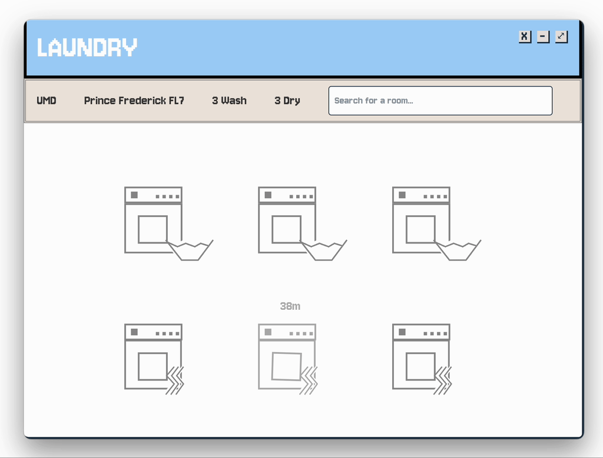
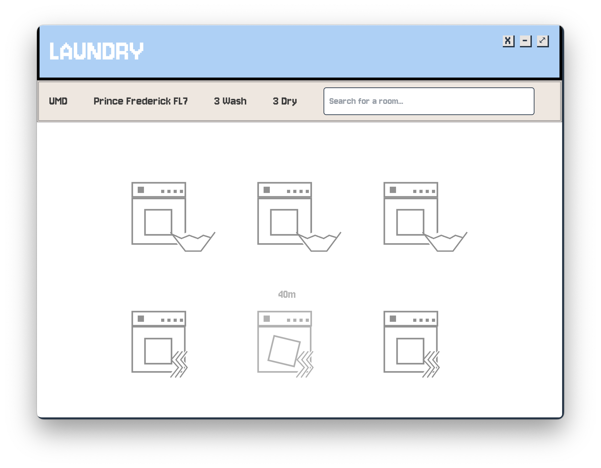
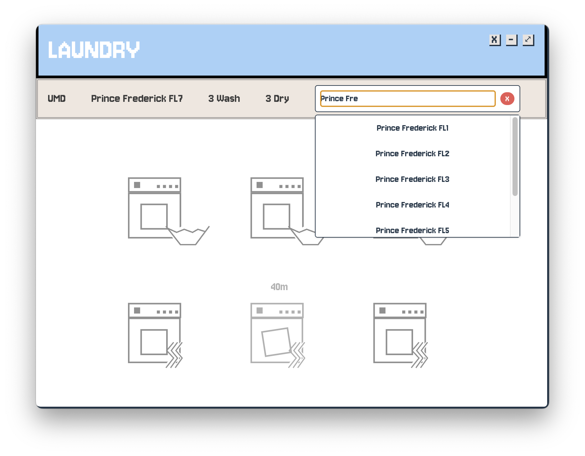
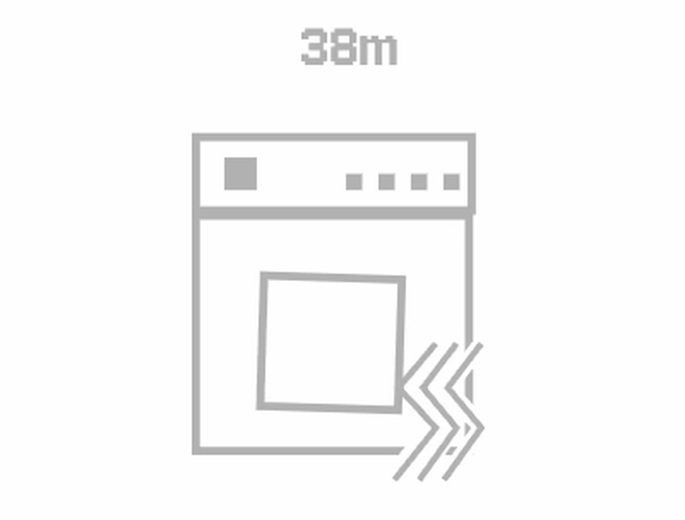

<h1 align="center">UMD Laundry App</h1>

An app to view the laundry in any building and room at UMD

 
 

  

 
<table border="0" cellpadding="0" cellspacing="0" width="100%">
  <tr>
    <td width="50%" valign="top">
      
    </td>
    <td width="50%" valign="top">
      <h3>A Fun Design</h3>
      
A design that shows the washers, dryers, and status for a building/floor. The UI makes the machines in use transparent and displays the remaining time above them.

    </td>
  </tr>
  <tr>
    <td width="50%" valign="top">
      
    </td>
    <td width="50%" valign="top">
      <h3>Search For Your Laundry</h3>
      
Use the handy-dandy search function to find your floor or building and see it's laundry. The app saves the selected option too for next time!

    </td>
  </tr>
  <tr>
    <td width="50%" valign="top">
      
    </td>
    <td width="50%" valign="top">
      <h3>Fun lil Animation</h3>
      
A lil animation that took wayyyyy too long but I think it's fun

    </td>
  </tr>
</table>
 
 
 
<h2>Code Details</h2>

This was coded by making use of my <a href="https://github.com/apers00n/umd-laundry-collection">previous code</a> from another project leveraging the csc services api in the csc go app. Check out that project to see more details on the API

<h3>Structure</h3>

- `./src/App.tsx` is where the main app is
- The search bar is in `./src/roomSelector.tsx`
- The machine svgs, the animation, and the general UI involved in the machines is in `./src/rotating.tsx`
- The logic behind getting data from the CSC API is in `./src/getInfo.tsx`. This is similar to the code in my <a href="https://github.com/apers00n/umd-laundry-collection">other repository</a>

> [!WARNING]  
> This code could stop working given the CSC API stops working. I reverse engineered the API but the UMD route or the API itself could very well change
